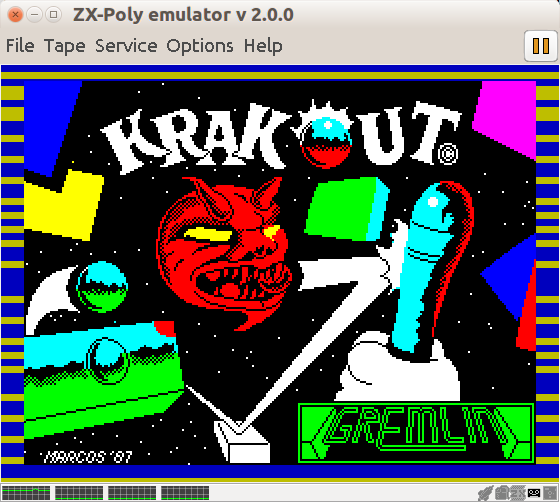
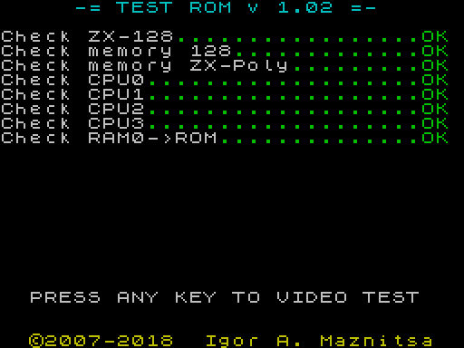
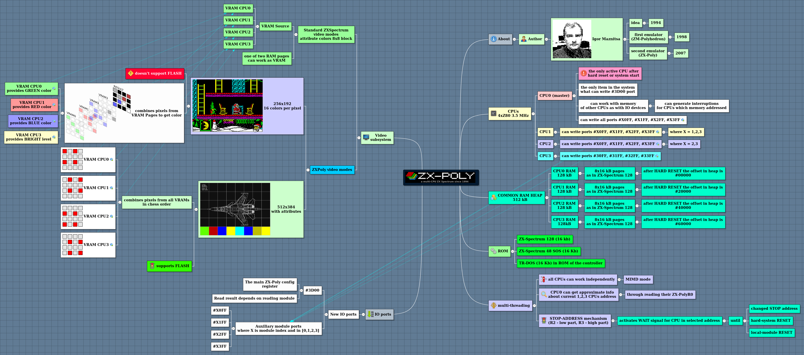
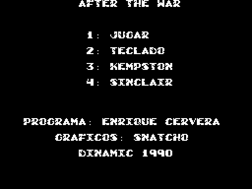
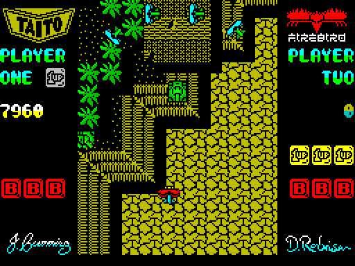
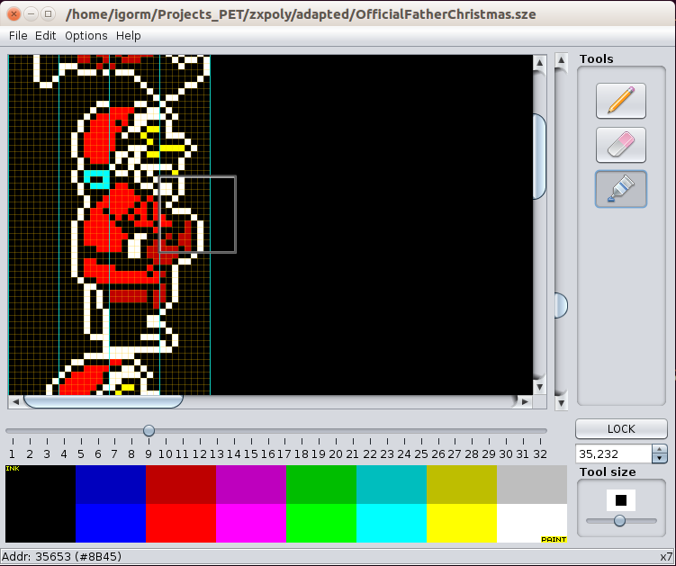
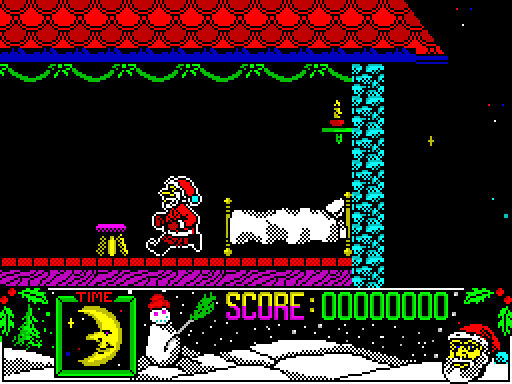

# Introduction
I got the idea of the platform in April 1994. I had some free time to think about well-known problem of ZX-Spectrum platform - [ATTRIBUTE CLASH](https://en.wikipedia.org/wiki/Attribute_clash). The idea was to rework a mono-system into a poly-system and add extra CPUs working in parallel to process its own color data. The solution provided some way not only keep back compatibility with existing software but also some way to use existing OS without changes.   

I am sure that ZX-Poly could be assembled even with electronic components produced in the USSR in middle of 80th and I guess we could have some four-core CPU home platform in that time. Unfortunately the idea was born too late and couldn't meet any interest from ZX-Spectrum producers in Russia. So that the emulator can be recognized as some proof of concept.

# License
The Emulator and all its parts are published under [GNU GPL3 license](http://www.gnu.org/licenses/gpl.html). So that it is absolutely free for any non-commercial and open-source use.

# UI

# Theory and structure of the ZX-Poly platform
    
The Base of the platform is the theory that stable synchronous systems (without any inside random processes) built on the same components (because different element base can be also source of random processes) by being started synchronously in the same time from the same state have the same state in any point of time if all synchronous system components get the same input signal states in the same time.

ZX-Poly platform adds several ports to manipulate work modes and the main port of the platform is #3D00. [In more details it is desribed in wiki.](https://github.com/raydac/zxpoly/wiki/Short-description-of-ZX-Poly-platform)

# F.A.Q.
## Is there a hardware implementation?
The Idea of the Platform was born in 1994 and it was too late to invest money and resources into hardware implementation because in Russia the sunset of ZX-Spectrum was in 1992-1993. I had some discussions with management of the Peters Plus company (the main developer of the Sprinter platform, the first world FPGA based ZX-Spectrum clone) but their platform was single-CPU one and the on-board FPGA was too weak to emulate a multi-Z80 platform.

## Does the platform need a custom OS?
No, it doesn't. ZX-Poly uses standard ZX-Spectrum 128 OS + TR-DOS. On start ZX-Poly even starts only one Z80 and three others in sleep mode and it is no so easy to detect difference in work with regular ZX-Spectrum 128 (I didn't find).

## What is difference with Spec256?
Both ZX-Poly and Spec256 work as [SIMD](https://en.wikipedia.org/wiki/SIMD) computers but ZX-Poly is based on 4 Z80 "real" CPUs and Spec256 has some mix of 8 bit + 64 bit virtual Z80 CPU under the hood, I made attempt to convert some games from Spec256 to ZX-Poly but attempt failed because Spec256 is much more tolerant for damage of execution code (it executes non changed program and only changed extra-graphical data is sent through virtual 64 bit registers, changed data blocks don't affect executing flow).

## Multi-threading
ZX-Poly is a normal multi-CPU system and can work as in SIMD mode (to be compatible with existing software) as in MIMD mode and in the mode all CPUs work independently. It has some primitive synchronization mechanism called STOP-ADDRESS which allows to align common start address for all CPUs, also CPU0 can get some approximate info about current executing addresses of other CPUs and can get even some signals through interruptions what makes possible to emulate some periphery (like sound devices) in slave CPUs. Each CPU has its own memory area in common heap but it is possible to override memory areas and even map them totally each other (in the case it will be just multi CPU ZX 128).

## Which software can be adapted for the platform?
The Main requirement - the software should not have optimization of graphic output and should not have check what it outputs on the screen, enough number of games work in such manner and also system utilities (ZX-Poly has 512x384 mode and it is possible to increase resolution of text utilities and editors just through their fonts and icons correction)

# Emulator supports formats
 - Snapshots .Z80, .SNA, .ZXP (ZX-Poly snapshot format produced by the Sprite Editor from .Z80 snapshots and included into the project)
 - Tape .TAP (allows export to WAV file)
 - Disks .TRD, .SCL

# Prebuilt versions
The Latest prebuilt versions of the emulator and sprite editor can be downloaded from [the release page](https://github.com/raydac/zxpoly/releases).   
The Emulator is written in Java and its pure JAR file can be started in command line with just `java -jar zxpoly-emul-2.0-SNAPSHOT.jar`   
By default it uses the embedded ZX-Poly Test ROM image for start, but you can pass through **File->Options->Active ROM** and select another SOS+TR-DOS 128 ROM source (from list of links) and after that reload the emulator, keep in mind that WorldOfSpectrum FTP works not very stable so I recommend prefer VirtualTRDOS as ROM source. After loading, the ROM will be cached on your machine for future usage.

# Supported videomodes
## Standard ZX-Spectrum 256x192 (2 colors per pixel in 8x8 block)
It is just regular ZX-Spectrum movde 256x192 with 2 attributed colors for 8x8 pixel block.

## ZX-Poly 256x192 (16 colors per pixel)
It is a family of video-modes and contain three sub-mode. All modes provide way for each pixel to get a color from standard ZX-Spectrum 16 color palette.

### ZX-Poly 256x192 STANDARD

It is just regular video mode without any masking. It just integrates pixel info from video-ram of all CPU modules and form 4 bit index in ZX-Spectrum palette.
[TRD disk with the example can be downloaded from here, the game has been partly colorized](adapted/Atw2/target/atw2.trd)
   
   

### ZX-Poly 256x192 EXTENSION MASK_INK+PAPER

It works as previous one and provide way to for 4 bit index for pixel, but also it analyses INK and PAPER colors from CPU0 video-ram and if INK = PAPER then whole block is filled by the INK color. It is made to provide way to make compatibility with games hidding some visual elements in areas with same INK and PAPER colors.

### ZX-Poly 256x192 EXTENSION MASK_FLUSH+INK+PAPER

It is the most complex from the video-mode family. It analyses FLASH bit of each attribute from CPU0 video-memory and turn on ZX-Poly mode only for blocks where FLASH bit is ON. In the same time it analyses INK and PAPER attribute values and if they the same then whole block is filled by INK else form pixel colors as in standard ZX-Poly mode. All blocks where FLASH is OFF are processed as in standard ZX-Spectrum video-mode. FLASH is not working in the mode (but it is no so often feature in games). The video-mode provides way to colorize games with color dynamic indicators and duotone game-play areas. 

## ZX-Poly 512x384 (2 colors per pixel placed in chess order)
The Mode uses attributes but places pixels in chess order.

[TRD disk with the example can be downloaded from here](adapted/ZxWord/target/zxword.trd)

# Adaptation of games

To adapt old games, I have developed special utility called ZX-Poly Sprite corrector, which can be found in releases. It is a very easy editor which shows images in data blocks and allows to redraw them. It supports import from Z80 and SNA snapshots and as the result it generates ZXP snapshots.

## "Official Father Christmas" (1989)
Original look of the game   

On Christmas 2017 I made some adaptation of the old game ["Official Father Christmas" (1989)](http://www.worldofspectrum.org/infoseekid.cgi?id=0003493) for ZX-Poly. Of course not all was smoothly, some elements of third level could not be colorized because their colorization broke game process and made CPU modules out of sync, it looks like that the level contains some optimization in graphics processing for those elements and presented some check for empty areas to optimize speed.   
Adapted game version in ZX-Poly emulator format can be downloaded [from here](adapted/OfficialFatherChristmas/OFCZXPOLY.zxp).   

## "Adventures of Buratino" (1993) 
I was playing with adaptation of the game for 512x384 mode, program code works well but the game and without adaptation is so colorful and detailed that big effect is not visible. Also it was impossible to adapt the main hero sprites because the same sprites are used for both right and left walk through mirroring.   
Adapted game version in ZX-Poly emulator format can be downloaded [from here](adapted/BuratinoAdventures/buratino_adventures.zxp).   

